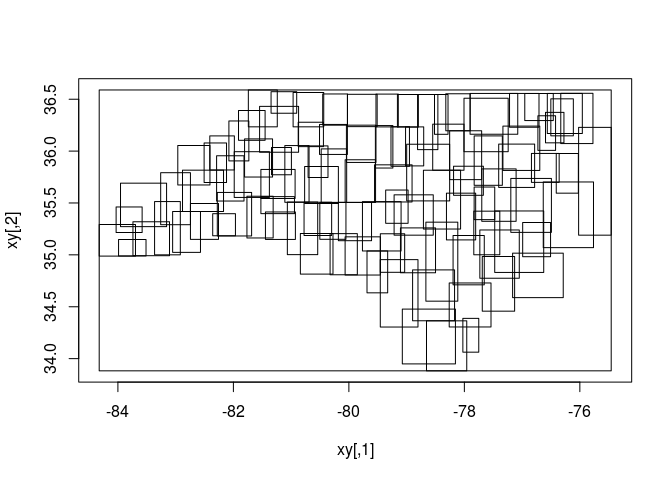

<!-- README.md is generated from README.Rmd. Please edit that file -->
vapour
======

The goal of vapour is to provide a basic **GDAL API** package for R. Ideally, this could become a common foundation for other packages to specialize. A parallel goal is to be freed from the powerful but sometimes limiting high-level data models of GDAL itself, specifically these are *simple features* and *affine-based regular rasters composed of 2D slices*. (GDAL will possibly remove these limitations over time but still there will always be value in having modularity in an ecosystem of tools. )

Currently all it does is read vector data attributes or geometry. This is inspired by and draws heavily on work done [the sf package, simple features for R and rgdal and rgdal2](https://github.com/r-spatial/sf).

Big thanks to Edzer Pebesma and Roger Bivand for prior art that I crib and copy from.

Examples
--------

There's a function `vapour_read_attributes` that returns the attributes as list of vectors.

``` r
pfile <- system.file("extdata", "point.shp", package = "vapour")
library(vapour)
vapour_read_attributes(pfile)
#> $a
#>  [1]  1  2  3  4  5  6  7  8  9 10
```

A higher level function `read_gdal_attribute` wraps that function to return a data frame.

``` r
sfile <- system.file("shape/nc.shp", package="sf")

read_gdal_table(sfile)
#> # A tibble: 100 x 14
#>     AREA PERIMETER CNTY_ CNTY_ID        NAME  FIPS FIPSNO CRESS_ID BIR74
#>    <dbl>     <dbl> <dbl>   <dbl>       <chr> <chr>  <dbl>    <int> <dbl>
#>  1 0.114     1.442  1825    1825        Ashe 37009  37009        5  1091
#>  2 0.061     1.231  1827    1827   Alleghany 37005  37005        3   487
#>  3 0.143     1.630  1828    1828       Surry 37171  37171       86  3188
#>  4 0.070     2.968  1831    1831   Currituck 37053  37053       27   508
#>  5 0.153     2.206  1832    1832 Northampton 37131  37131       66  1421
#>  6 0.097     1.670  1833    1833    Hertford 37091  37091       46  1452
#>  7 0.062     1.547  1834    1834      Camden 37029  37029       15   286
#>  8 0.091     1.284  1835    1835       Gates 37073  37073       37   420
#>  9 0.118     1.421  1836    1836      Warren 37185  37185       93   968
#> 10 0.124     1.428  1837    1837      Stokes 37169  37169       85  1612
#> # ... with 90 more rows, and 5 more variables: SID74 <dbl>, NWBIR74 <dbl>,
#> #   BIR79 <dbl>, SID79 <dbl>, NWBIR79 <dbl>
```

There are many useful higher level operations that can be used with this. The simplest is the ability to use GDAL as a database-like connection to attribute tables.

A low-level function will return a character vector of JSON, GML, KML or WKT.

``` r
vapour_read_geometry(pfile)[5:6]  ## format = "WKB"
#> [[1]]
#>  [1] 01 01 00 00 00 00 00 60 08 18 ad ec 3f 00 00 e0 9a ec 77 e2 3f
#> 
#> [[2]]
#>  [1] 01 01 00 00 00 00 00 c0 40 3c bb d0 3f 00 00 80 0e 30 25 d5 3f

vapour_read_geometry_text(pfile)[5:6]  ## format = "json"
#> [1] "{ \"type\": \"Point\", \"coordinates\": [ 0.89612962375395, 0.577139189234003 ] }" 
#> [2] "{ \"type\": \"Point\", \"coordinates\": [ 0.261427939636633, 0.330394758377224 ] }"

sfile <- system.file("shape/nc.shp", package="sf")

vapour_read_geometry_text(sfile, format = "gml")[99:100]
#> [1] "<gml:Polygon srsName=\"EPSG:4267\"><gml:outerBoundaryIs><gml:LinearRing><gml:coordinates>-77.9607315063477,34.1892433166504 -77.9658660888672,34.2422866821289 -77.9752807617188,34.2433624267578 -77.9831466674805,34.2616806030273 -78.0002212524414,34.2678833007812 -77.9953918457031,34.2827987670898 -78.0070190429688,34.2848167419434 -78.0113067626953,34.312614440918 -78.0259246826172,34.3287696838379 -77.9866790771484,34.339916229248 -77.9944534301758,34.3623161315918 -77.9790725708008,34.3756866455078 -77.9498138427734,34.3660850524902 -77.9439392089844,34.3564376831055 -77.9217834472656,34.3733139038086 -77.888069152832,34.364070892334 -77.8283843994141,34.3879699707031 -77.8091430664062,34.359432220459 -77.7505264282227,34.305046081543 -77.864387512207,34.1927375793457 -77.894401550293,34.0691795349121 -77.9267578125,34.0620346069336 -77.9607315063477,34.1892433166504</gml:coordinates></gml:LinearRing></gml:outerBoundaryIs></gml:Polygon>"                                                                                                                                             
#> [2] "<gml:Polygon srsName=\"EPSG:4267\"><gml:outerBoundaryIs><gml:LinearRing><gml:coordinates>-78.6557159423828,33.948673248291 -78.6347198486328,33.9779777526855 -78.6302719116211,34.0102005004883 -78.5877838134766,34.0306053161621 -78.5634307861328,34.0589447021484 -78.5442810058594,34.134162902832 -78.5272369384766,34.154857635498 -78.4927444458008,34.158504486084 -78.4254302978516,34.1380653381348 -78.3611221313477,34.1867218017578 -78.3735733032227,34.2023506164551 -78.2610626220703,34.2152633666992 -78.15478515625,34.3622436523438 -78.130241394043,34.3641242980957 -78.0259246826172,34.3287696838379 -78.0113067626953,34.312614440918 -78.0070190429688,34.2848167419434 -77.9953918457031,34.2827987670898 -78.0002212524414,34.2678833007812 -77.9831466674805,34.2616806030273 -77.9752807617188,34.2433624267578 -77.9658660888672,34.2422866821289 -77.9607315063477,34.1892433166504 -77.9585266113281,33.9925804138184 -78.0348052978516,33.9142913818359 -78.579719543457,33.8819923400879 -78.6557159423828,33.948673248291</gml:coordinates></gml:LinearRing></gml:outerBoundaryIs></gml:Polygon>"

vapour_read_geometry_text(sfile, format = "kml")[1:2]
#> [1] "<Polygon><outerBoundaryIs><LinearRing><coordinates>-81.4727554321289,36.2343559265137 -81.5408401489258,36.2725067138672 -81.5619812011719,36.2735939025879 -81.6330642700195,36.3406867980957 -81.7410736083984,36.3917846679688 -81.6982803344727,36.4717788696289 -81.7027969360352,36.5193405151367 -81.6699981689453,36.5896492004395 -81.3452987670898,36.5728645324707 -81.347541809082,36.537914276123 -81.3247756958008,36.5136795043945 -81.3133239746094,36.4806976318359 -81.2662353515625,36.4372062683105 -81.2628402709961,36.4050407409668 -81.2406921386719,36.3794174194336 -81.2398910522461,36.365364074707 -81.2642440795898,36.3524131774902 -81.3289947509766,36.3635025024414 -81.3613739013672,36.3531608581543 -81.3656921386719,36.3390502929688 -81.354133605957,36.2997169494629 -81.3674545288086,36.2786979675293 -81.4063873291016,36.2850532531738 -81.4123306274414,36.2672920227051 -81.431037902832,36.2607192993164 -81.4528884887695,36.2395858764648 -81.4727554321289,36.2343559265137</coordinates></LinearRing></outerBoundaryIs></Polygon>"
#> [2] "<Polygon><outerBoundaryIs><LinearRing><coordinates>-81.2398910522461,36.365364074707 -81.2406921386719,36.3794174194336 -81.2628402709961,36.4050407409668 -81.2662353515625,36.4372062683105 -81.3133239746094,36.4806976318359 -81.3247756958008,36.5136795043945 -81.347541809082,36.537914276123 -81.3452987670898,36.5728645324707 -80.9034423828125,36.5652122497559 -80.9335479736328,36.4983139038086 -80.9657745361328,36.4672203063965 -80.9496688842773,36.4147338867188 -80.9563903808594,36.4037971496582 -80.9779510498047,36.3913764953613 -80.9828414916992,36.3718338012695 -81.0027770996094,36.3666801452637 -81.0246429443359,36.3778343200684 -81.0428009033203,36.4103355407715 -81.0842514038086,36.4299201965332 -81.0985641479492,36.43115234375 -81.1133117675781,36.4228515625 -81.1293792724609,36.4263305664062 -81.1383972167969,36.4176254272461 -81.1533660888672,36.4247398376465 -81.1766738891602,36.4154434204102 -81.2398910522461,36.365364074707</coordinates></LinearRing></outerBoundaryIs></Polygon>"
```

We can combine these together to get a custom data set.

``` r
library(dplyr)
dat <- read_gdal_table(sfile) %>% dplyr::mutate(kml = vapour_read_geometry_text(sfile, format = "kml"))
glimpse(dat)
#> Observations: 100
#> Variables: 15
#> $ AREA      <dbl> 0.114, 0.061, 0.143, 0.070, 0.153, 0.097, 0.062, 0.0...
#> $ PERIMETER <dbl> 1.442, 1.231, 1.630, 2.968, 2.206, 1.670, 1.547, 1.2...
#> $ CNTY_     <dbl> 1825, 1827, 1828, 1831, 1832, 1833, 1834, 1835, 1836...
#> $ CNTY_ID   <dbl> 1825, 1827, 1828, 1831, 1832, 1833, 1834, 1835, 1836...
#> $ NAME      <chr> "Ashe", "Alleghany", "Surry", "Currituck", "Northamp...
#> $ FIPS      <chr> "37009", "37005", "37171", "37053", "37131", "37091"...
#> $ FIPSNO    <dbl> 37009, 37005, 37171, 37053, 37131, 37091, 37029, 370...
#> $ CRESS_ID  <int> 5, 3, 86, 27, 66, 46, 15, 37, 93, 85, 17, 79, 39, 73...
#> $ BIR74     <dbl> 1091, 487, 3188, 508, 1421, 1452, 286, 420, 968, 161...
#> $ SID74     <dbl> 1, 0, 5, 1, 9, 7, 0, 0, 4, 1, 2, 16, 4, 4, 4, 18, 3,...
#> $ NWBIR74   <dbl> 10, 10, 208, 123, 1066, 954, 115, 254, 748, 160, 550...
#> $ BIR79     <dbl> 1364, 542, 3616, 830, 1606, 1838, 350, 594, 1190, 20...
#> $ SID79     <dbl> 0, 3, 6, 2, 3, 5, 2, 2, 2, 5, 2, 5, 4, 4, 6, 17, 4, ...
#> $ NWBIR79   <dbl> 19, 12, 260, 145, 1197, 1237, 139, 371, 844, 176, 59...
#> $ kml       <chr> "<Polygon><outerBoundaryIs><LinearRing><coordinates>...
```

Fast summary
------------

There is a basic function `vapour_read_extent` to return a straight forward bounding box vector for every feature, so that we can flexibly build an index of a data set for later use.

``` r
sfile <- system.file("shape/nc.shp", package="sf")
str(vapour_read_extent(sfile))
#> List of 100
#>  $ : num [1:4] -81.7 -81.2 36.2 36.6
#>  $ : num [1:4] -81.3 -80.9 36.4 36.6
#>  $ : num [1:4] -81 -80.4 36.2 36.6
#>  $ : num [1:4] -76.3 -75.8 36.1 36.6
#>  $ : num [1:4] -77.9 -77.1 36.2 36.6
#>  $ : num [1:4] -77.2 -76.7 36.2 36.6
#>  $ : num [1:4] -76.6 -76 36.2 36.6
#>  $ : num [1:4] -77 -76.5 36.3 36.6
#>  $ : num [1:4] -78.3 -77.9 36.2 36.6
#>  $ : num [1:4] -80.5 -80 36.3 36.6
#>  $ : num [1:4] -79.5 -79.1 36.2 36.5
#>  $ : num [1:4] -80 -79.5 36.2 36.5
#>  $ : num [1:4] -78.8 -78.5 36 36.5
#>  $ : num [1:4] -79.2 -78.8 36.2 36.5
#>  $ : num [1:4] -78.5 -78.3 36.2 36.5
#>  $ : num [1:4] -78 -77.2 36 36.5
#>  $ : num [1:4] -76.5 -76.1 36.1 36.5
#>  $ : num [1:4] -81.5 -80.9 36 36.4
#>  $ : num [1:4] -81.9 -81.5 36.1 36.4
#>  $ : num [1:4] -76.6 -76.3 36.1 36.4
#>  $ : num [1:4] -76.7 -76.4 36 36.3
#>  $ : num [1:4] -82.1 -81.7 35.9 36.3
#>  $ : num [1:4] -80.9 -80.4 36 36.3
#>  $ : num [1:4] -78.5 -78 35.8 36.3
#>  $ : num [1:4] -80.5 -80 36 36.3
#>  $ : num [1:4] -80 -79.5 35.9 36.3
#>  $ : num [1:4] -79.5 -79.2 35.8 36.2
#>  $ : num [1:4] -77.3 -76.7 35.8 36.2
#>  $ : num [1:4] -79.3 -79 35.9 36.2
#>  $ : num [1:4] -79 -78.7 35.9 36.2
#>  $ : num [1:4] -78.3 -77.7 35.7 36.2
#>  $ : num [1:4] -82.4 -82 35.8 36.1
#>  $ : num [1:4] -77.8 -77.3 35.7 36.1
#>  $ : num [1:4] -81.8 -81.3 35.8 36.1
#>  $ : num [1:4] -82.5 -82.1 35.7 36.1
#>  $ : num [1:4] -77.4 -76.8 35.7 36.1
#>  $ : num [1:4] -79 -78.3 35.5 36.1
#>  $ : num [1:4] -83 -82.4 35.7 36.1
#>  $ : num [1:4] -81.1 -80.7 35.5 36.1
#>  $ : num [1:4] -80.7 -80.4 35.7 36.1
#>  $ : num [1:4] -81.3 -81 35.8 36
#>  $ : num [1:4] -80.5 -80 35.5 36
#>  $ : num [1:4] -82 -81.4 35.6 36
#>  $ : num [1:4] -76.8 -76.4 35.7 36
#>  $ : num [1:4] -76.4 -76 35.6 36
#>  $ : num [1:4] -82.3 -81.8 35.5 36
#>  $ : num [1:4] -80.1 -79.5 35.5 35.9
#>  $ : num [1:4] -79.6 -78.9 35.5 35.9
#>  $ : num [1:4] -78.2 -77.7 35.6 35.9
#>  $ : num [1:4] -80.8 -80.2 35.5 35.9
#>  $ : num [1:4] -77.7 -77.1 35.3 35.8
#>  $ : num [1:4] -81.5 -80.9 35.5 35.8
#>  $ : num [1:4] -82.9 -82.2 35.4 35.8
#>  $ : num [1:4] -78.7 -78.1 35.2 35.8
#>  $ : num [1:4] -83.3 -82.7 35.3 35.8
#>  $ : num [1:4] -76 -75.5 35.2 36.2
#>  $ : num [1:4] -77.2 -76.5 35.2 35.7
#>  $ : num [1:4] -84 -83.2 35.3 35.7
#>  $ : num [1:4] -77.8 -77.5 35.3 35.7
#>  $ : num [1:4] -79.4 -79 35.3 35.6
#>  $ : num [1:4] -82.3 -81.7 35.2 35.6
#>  $ : num [1:4] -78.3 -77.8 35.1 35.6
#>  $ : num [1:4] -79.2 -78.5 35.2 35.6
#>  $ : num [1:4] -81.8 -81.3 35.2 35.6
#>  $ : num [1:4] -81.5 -80.9 35.4 35.6
#>  $ : num [1:4] -83.4 -82.9 35 35.5
#>  $ : num [1:4] -79.8 -79.1 35 35.5
#>  $ : num [1:4] -81.1 -80.5 35 35.5
#>  $ : num [1:4] -80.8 -80.3 35.2 35.5
#>  $ : num [1:4] -80.2 -79.6 35.1 35.5
#>  $ : num [1:4] -80.5 -80.1 35.1 35.5
#>  $ : num [1:4] -82.7 -82.3 35.1 35.5
#>  $ : num [1:4] -84 -83.6 35.2 35.5
#>  $ : num [1:4] -77.8 -77.4 35 35.4
#>  $ : num [1:4] -83.1 -82.6 35 35.4
#>  $ : num [1:4] -81.4 -80.9 35.1 35.4
#>  $ : num [1:4] -82.4 -82 35.2 35.4
#>  $ : num [1:4] -83.7 -83.1 35 35.3
#>  $ : num [1:4] -78.7 -78.1 34.6 35.3
#>  $ : num [1:4] -77 -76.5 35 35.3
#>  $ : num [1:4] -84.3 -83.7 35 35.3
#>  $ : num [1:4] -79.1 -78.5 34.8 35.3
#>  $ : num [1:4] -77.7 -77 34.8 35.2
#>  $ : num [1:4] -80.8 -80.3 34.8 35.2
#>  $ : num [1:4] -80.3 -79.9 34.8 35.2
#>  $ : num [1:4] -79.5 -79 34.8 35.2
#>  $ : num [1:4] -76.6 -75.8 35.1 35.7
#>  $ : num [1:4] -78.2 -77.7 34.7 35.2
#>  $ : num [1:4] -80.1 -79.5 34.8 35.2
#>  $ : num [1:4] -84 -83.5 35 35.1
#>  $ : num [1:4] -77.5 -76.6 34.8 35.4
#>  $ : num [1:4] -79.7 -79.3 34.6 35
#>  $ : num [1:4] -77.7 -77.1 34.5 35
#>  $ : num [1:4] -79.5 -78.8 34.3 35
#>  $ : num [1:4] -77.2 -76.3 34.6 35
#>  $ : num [1:4] -78.9 -78.2 34.4 34.9
#>  $ : num [1:4] -78.3 -77.5 34.3 34.7
#>  $ : num [1:4] -79.1 -78.2 33.9 34.5
#>  $ : num [1:4] -78 -77.8 34.1 34.4
#>   [list output truncated]
```

This makes for a very lightweight summary data set that will scale to hundreds of large inputs.

``` r
dat <- read_gdal_table(sfile)
library(raster)
#> Loading required package: sp
#> 
#> Attaching package: 'raster'
#> The following object is masked from 'package:dplyr':
#> 
#>     select
dat$bbox <- vapour_read_extent(sfile)

plot(purrr::reduce(lapply(dat$bbox, raster::extent), raster::union))
purrr::walk(lapply(dat$bbox, raster::extent), plot, add = TRUE)
```



An example is this set of 29 property boundary shapefiles, read into a few hundred Mb of simple features.

``` r
library(dplyr)
files <- raadfiles::thelist_files(format = "") %>% filter(grepl("parcel", fullname), grepl("shp$", fullname))
#> Warning in raadfiles::thelist_files(format = ""): datadir and file root
#> don't match?
library(vapour)
system.time(purrr::map(files$fullname, sf::read_sf))
#>    user  system elapsed 
#>  26.574   1.015  27.734
# user  system elapsed
# 43.124   2.857  39.386
library(blob)

## our timing is competitive, and we get to choose what is read
## and when
system.time({
d <- purrr::map(files$fullname, read_gdal_table)
d <- dplyr::bind_rows(d)
g <- purrr::map(files$fullname, read_gdal_geometry)
d[["wkb"]] <- new_blob(unlist(g, recursive = FALSE))
})
#>    user  system elapsed 
#>  14.282   1.239  15.720
# user  system elapsed
# 16.400   2.882  23.227
#pryr::object_size(d)
## 359 MB
```

We can read that in this simpler way for a quick data set to act as an index.

``` r
system.time({
  d <- purrr::map_df(files$fullname, read_gdal_table)
  d$bbox <- unlist(purrr::map(files$fullname, vapour_read_extent), recursive = FALSE)
})
#>    user  system elapsed 
#>  11.481   0.891  12.547

pryr::object_size(d)
#> 177 MB
glimpse(d)
#> Observations: 411,017
#> Variables: 20
#> $ CID        <chr> "", "", "", "", "", "", "", "", "", "", "", "", "",...
#> $ VOLUME     <chr> "169864", "", "", "136703", "", "", "212990", "2449...
#> $ FOLIO      <int> 2, 0, 0, 1, 0, 0, 1, 1, 0, 1, 0, 0, 9, 0, 1, 0, 8, ...
#> $ PID        <chr> "", "", "", "", "", "", "", "", "", "", "", "", "",...
#> $ POT_PID    <chr> "", "", "", "", "", "", "", "", "", "", "", "", "",...
#> $ LPI        <chr> "FEV10", "KKL85", "", "HSY23", "GES42", "", "480244...
#> $ CAD_TYPE1  <chr> "Private Parcel", "Authority Land", "Authority Land...
#> $ CAD_TYPE2  <chr> "Private Parcel", "Forestry Tasmania", "Forestry Ta...
#> $ TENURE_TY  <chr> "Freehold Title", "Crown Land", "Crown Land", "Crow...
#> $ FEAT_NAME  <chr> "", "", "", "", "", "", "", "", "", "", "", "", "",...
#> $ STRATA_LEV <chr> "Not Applicable", "Not Applicable", "Not Applicable...
#> $ COMP_AREA  <dbl> 1200513.096, 23096.094, 148147.128, 4603209.423, 48...
#> $ MEAS_AREA  <dbl> 1207000, 0, 0, 0, 0, 0, 0, 136700, 0, 0, 0, 18260, ...
#> $ UFI        <chr> "cad013844403", "cad013933348", "cad013933302", "ca...
#> $ FMP        <chr> "cad000029000", "cad000029000", "cad000029000", "ca...
#> $ CREATED_ON <chr> "2015-08-25 14:31:57", "2016-04-07 10:22:12", "2016...
#> $ LIST_GUID  <chr> "{d1b80f74-2873-46d1-a6ed-d1d27a45bd6e}", "{3cb147d...
#> $ SHAPE_AREA <dbl> 1200513.096, 23096.094, 148147.128, 4603209.423, 48...
#> $ SHAPE_LEN  <dbl> 4382.7258, 2365.0896, 14870.8324, 16288.4164, 14990...
#> $ bbox       <list> [<551456.8, 552738.1, 5413518.9, 5414799.6>, <5544...
```

Set up
------

I've kept a record of a minimal GDAL wrapper package here:

<https://github.com/mdsumner/gdalmin>

This must be run when your function definitions change:

``` r
tools::package_native_routine_registration_skeleton("../vapour", "src/init.c",character_only = FALSE)
```

Code of conduct
===============

Please note that this project is released with a [Contributor Code of Conduct](CONDUCT.md). By participating in this project you agree to abide by its terms.
